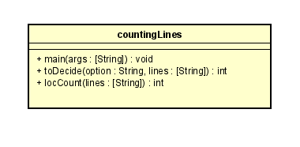

# INTRODUCTION TO JAVA, MVN, AND GIT: LOC Counting
## Daniel Santiago Ducuara Ardila
## 02/06/2021
 
El método main es quien se encarga de recibir los parámetros indicados por el usuario y de ingresar cada linea a una lista.
El metodo toDecide se encarga de recibir como parámetros la lista creada en el main y el tipo de conteo, dependiendo del
tipo de conteo retorna el valor de una vez si el parámetro es phy, si el parametro es loc se llama a la funcion locCount.
locCount es el método encargado de realizar la cuenta sin tener en cuenta las lineas en blanco o las lineas comentadas, al
final retorna el valor del conteo a la función toDecide.

La productividad de este proyecto fue de 199LOC/8h 

